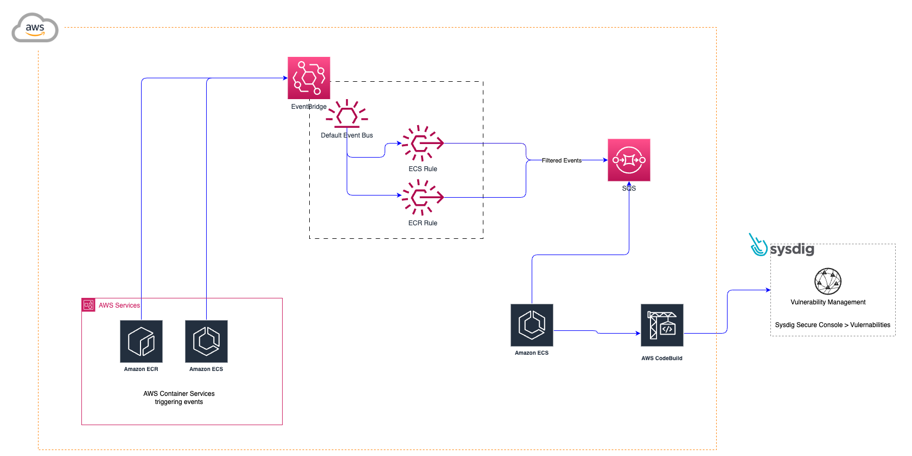

# Trigger Sysdig scan based on aws service events

The project triggers a codebuild job which scans images using [Sysdig Secure Vulnerability Agent](https://docs.sysdig.com/en/docs/installation/sysdig-secure/install-vulnerability-cli-scanner/) an image when certain events occur. The project only listens for two types of events for two AWS Services - ECS & ECR.

## High Level Diagram (HLD) for solution



## Events which trigger a scan

### ECR Push

```json
{
  "source": ["aws.ecr"],
  "detail-type": ["ECR Image Action"],
  "detail": {
    "action-type":["PUSH"],
    "result": ["SUCCESS"]
  }
}
```

### ECS StartTask

```json
{
  "source": ["aws.ecs"],
  "detail-type": ["ECS Task State Change"],
  "detail": {
    "lastStatus":["PENDING"],
    "desiredStatus":["RUNNING"]
  }
}
```

## How to build the project

Make sure you add the following values before building:
1. AWS account ID
2. AWS region
3. Sysdig Secure Token
4. Sysdig Secure URL

The following secrets should be setup in secrets managert `SYSDIG_SECURE_TOKEN` and `SYSDIG_SECURE_ENDPOINT`.

```sh
cd terraform/dev/event-scan
terraform apply
```

## How to destroy the project

```sh
cd terraform/dev/event-scan
terraform destroy
```
